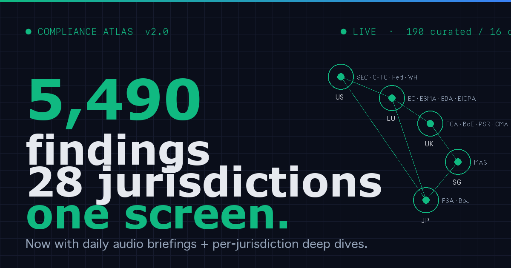

# Compliance Atlas

> **5,490 findings. 28 jurisdictions. One screen.**
> Real-time regulatory monitoring that actually works.



🌊 **[LIVE → compliance-atlas.onrender.com](https://compliance-atlas.onrender.com/)** — v2.0.0 deployed on Render, all systems green.

## What this is

A public showcase of the RegSwarm compliance monitoring pipeline. The internal
system tracks 5,490 raw findings across 28 jurisdictions daily, using 5
LLM-powered agents to dedupe, classify, and cross-reference.

This public version curates that down to **190 findings** across **5 jurisdictions**
(US Federal, EU, UK, Singapore, Japan) and **2 sectors** (fintech, crypto),
filtered to critical and high severity only.

## The false-failure reveal

> "You can't track global regulation without a team of fifty."
> — every consultant, every SaaS pitch deck, every LinkedIn thought leader

This dashboard tracks **5,490 raw findings across 28 jurisdictions**, every day,
with **one operator and one agent swarm**. No team of fifty. No enterprise SaaS.
No six-figure annual subscription.

| What they say | What we do |
|---|---|
| Need a team of 50 | One operator + one agent swarm |
| Need enterprise SaaS | RSS feeds + LLM dedup |
| Need six-figure budget | Free tier on Render |
| Need a hundred dashboards | One screen, 5 jurisdictions |

## How it works

```
┌──────────┐    ┌──────────┐    ┌──────────┐    ┌──────────┐
│ 1. SCAN  │ →  │ 2. FILTER│ →  │ 3. CROSS │ →  │ 4. CURATE│
│ RSS feeds│    │ Dedup +  │    │ Conflict │    │ Top 200  │
│ 5+ sourc │    │ Severity │    │ detect   │    │ public   │
└──────────┘    └──────────┘    └──────────┘    └──────────┘
```

1. **Scan** — 5+ regulatory sources via RSS. Federal, EU, UK, Singapore, Japan.
2. **Filter** — LLM-powered dedup + severity classification. 5,490 → ~250.
3. **Cross-reference** — same topic, multiple jurisdictions → conflict cards.
4. **Curate** — only the top 200 by urgency make the public cut.

## Quick start

```bash
# Install
git clone https://github.com/nvmmonsalud/compliance-atlas
cd compliance-atlas
pip install -r requirements.txt

# Generate curated public data from your own internal feed
# (you'll need the full 5,490-finding JSONL; see curate.py for schema)
python curate.py

# Run the API + static site locally
gunicorn api_combined:app --bind 0.0.0.0:8080

# Open http://localhost:8080
```

## Architecture

| File | Purpose |
|---|---|
| `curate.py` | Reads `regulatory-feed.jsonl` → produces 5 public JSON files in `data/public/` |
| `api_combined.py` | Single Flask app: serves static `public/` + JSON API at `/api/*` |
| `public/index.html` | Landing page with live data |
| `public/og.png` | 1200×630 OG image |
| `public/REEL.md` | 60s + 90s Reel scripts, 4-platform caption pack, TTS voice memo |
| `render.yaml` | Render deployment config |

## API

| Endpoint | Returns |
|---|---|
| `GET /` | Landing page |
| `GET /api/summary` | Aggregate stats |
| `GET /api/findings` | All curated findings (with `?severity`, `?jurisdiction`, `?sector`, `?limit` filters) |
| `GET /api/conflicts` | Cross-jurisdiction conflict cards |
| `GET /api/arbitrage` | Operational arbitrage opportunities |
| `GET /api/sectors` | Sector breakdown |
| `GET /api/health` | Liveness check |

All endpoints CORS-open. No auth. No rate limit. By design.

## 🌊 Live demo

👉 **https://compliance-atlas.onrender.com/**

- **API example**: `curl https://compliance-atlas.onrender.com/api/summary`

> Deploy via Render: import this repo, Render auto-detects `render.yaml` and deploys in ~2 minutes.
> Or click the button below (replace `YOUR_RENDER_SUBDOMAIN` after first deploy):

[](https://render.com/deploy?repo=https://github.com/nvmmonsalud/compliance-atlas)

## License

MIT — fork it, point it at your sector, run it on a Raspberry Pi if you want.

## Credits

- Built by [NVM](https://github.com/nvmmonsalud)
- Powered by a RegSwarm agent pipeline (5 LLM agents, RSS aggregation, daily regen)
- The internal atlas tracks 28 jurisdictions; this public version curates to 5
